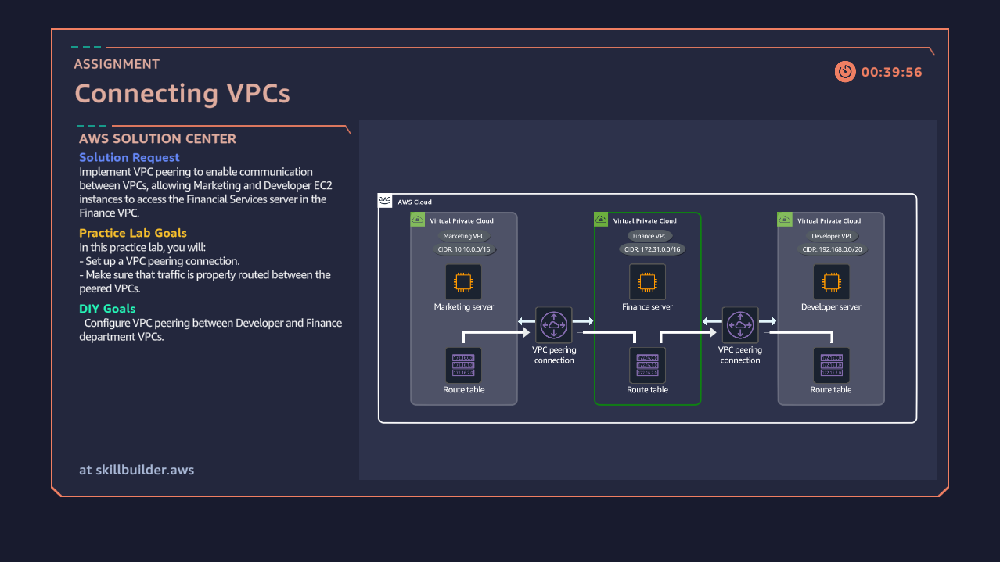

# Connecting VPCs Using VPC Peering

## Overview
This project demonstrates secure communication between multiple AWS Virtual
Private Clouds (VPCs) using VPC peering. The lab simulates networking between
Marketing, Finance, and Developer environments while maintaining network
segmentation and explicit routing.

## Services Used
- Amazon VPC
- VPC Peering
- Route Tables
- EC2

## Architecture
The design consists of three VPCs, each hosting an EC2 instance. The Finance VPC
serves as a central peering hub.

## Implementation Details
- Created VPC peering connections:
  - Marketing ↔ Finance
  - Developer ↔ Finance
- Updated route tables for each VPC CIDR block
- Verified private EC2-to-EC2 connectivity
- Ensured no transitive routing occurred

## Outcome
Secure, private communication enabled between isolated VPC environments.

## Key Learnings
- VPC peering limitations
- Cross-VPC routing
- Multi-VPC architecture design
