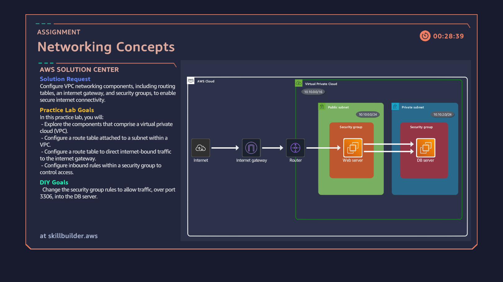

# VPC Networking and Security Architecture

## Overview
This project demonstrates core AWS networking and security concepts, including Virtual Private Cloud (VPC) design, public and private subnets, routing, and security groups. The architecture follows AWS best practices for isolating application tiers and protecting backend resources.

## Architecture
The design consists of a public subnet hosting a web server and a private subnet hosting a database server. Internet access is controlled through routing and security group rules.

## Architecture Diagram

## AWS Services and Components Used
- Amazon VPC
- Public and Private Subnets
- Internet Gateway
- Route Tables
- Security Groups
- Amazon EC2 (Web and Database tiers)

## Networking Design Decisions
- Placed the web server in a public subnet to allow controlled internet traffic.
- Isolated the database server in a private subnet with no direct internet exposure.
- Used route tables to manage traffic flow between subnets.
- Restricted access between tiers using security group rules.

## Security Considerations
- Allowed inbound traffic to the web tier only on required ports.
- Allowed database access only from the web server security group.
- Followed the principle of least privilege at the network level.

## What I Learned
- How VPC components work together
- Difference between public and private subnets
- How security groups and routing enforce isolation

## Notes
Hands-on experience gained through AWS Cloud Quest and a personal AWS account.
